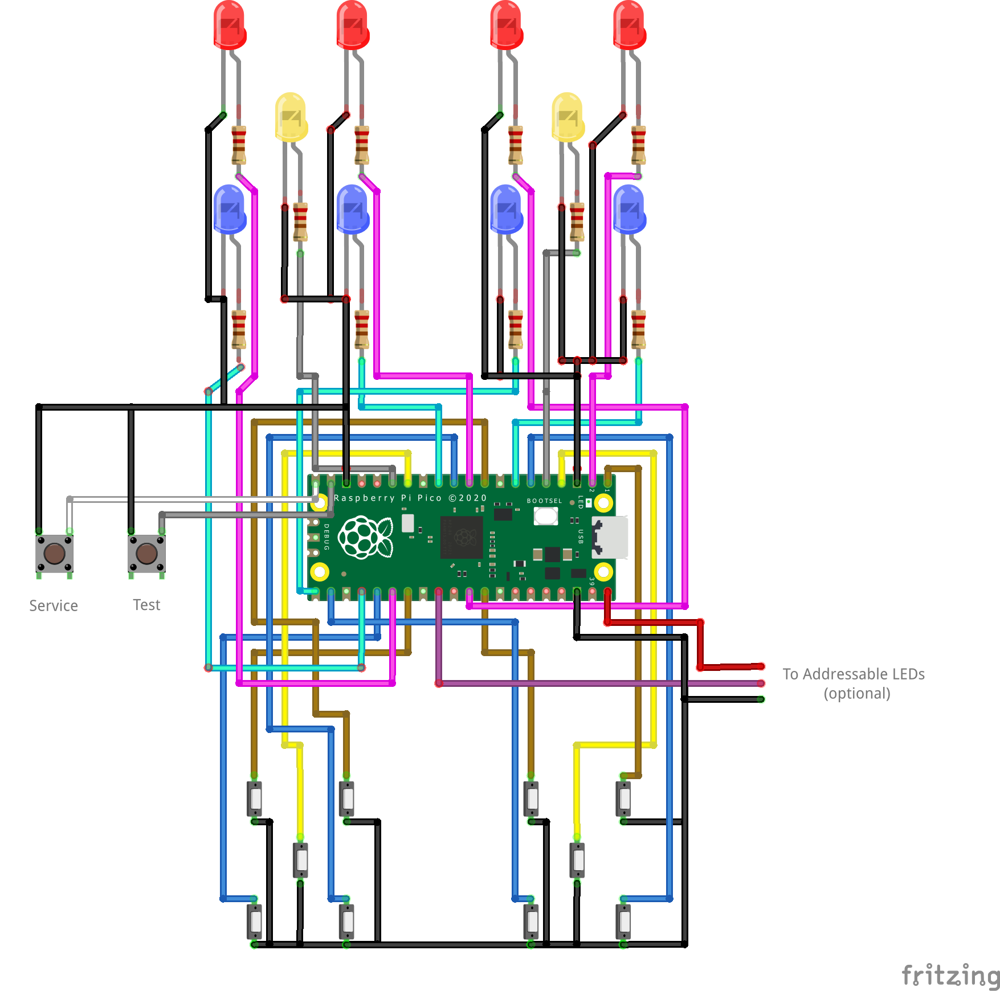

# PIUIO-PICO

This is a Pump it Up IO board (PIUIO) clone based on the Raspberry Pi Pico microcontroller.

Though designed for [dj505's PicoFX handpump controller](https://github.com/dj505/PicoFX), this will work with DIY hand pump controller builds, and can probably be adapted for pad use, too.

## Hardware Setup
You don't need many components to put one together:
 - Raspberry Pi Pico
 - 12x switches (for the 10 pad switches, plus test and service buttons)
 - 10x LEDs and appropriate resistors

By default the pins are configured as shown below, but the pins can be changed in `piuio_config.h`.

## Firmware Setup
[See the Pi Pico SDK repo](https://github.com/raspberrypi/pico-sdk) for instructions on preparing the build environment. All the required CMake files should already be present and ready for compilation.

General overview:
 - Add the SDK via your method of choice (see the pico-sdk repo)
 - Run `git submodule update --init` inside the SDK directory to set up the other required libraries (namely tinyusb)
 - Create the "build" folder inside the "piuio-pico" folder.
 - Inside the build folder, run `cmake ..`, then run `make`. You'll get a .UF2 file in the build folder that you can upload to the Pico!
 - With the Pico unplugged from the PC, hold the "BOOTSEL" button on the Pico, then plug in the Pico.
 - The Pico will now show up as a "flash drive" in your OS. Copy the .UF2 file onto the Pico, and the code will be uploaded!

## PIU Online Notice
Using a hand controller with games connected to the official Pump it Up online service is considered cheating by Andamiro and may lead to actions being taken against your account.
As such, this use case is not officially endorsed by piuio-pico.

## Credits
This project is based off of the [tinyusb device USB examples](https://github.com/hathach/tinyusb/tree/master/examples/device) (specifically webusb_serial and hid_generic_input)

Protocol information from the [PIUIO_Arduino](https://github.com/ckdur/PIUIO_Arduino/) and [piuio_clone](https://github.com/racerxdl/piuio_clone/) repositories.
